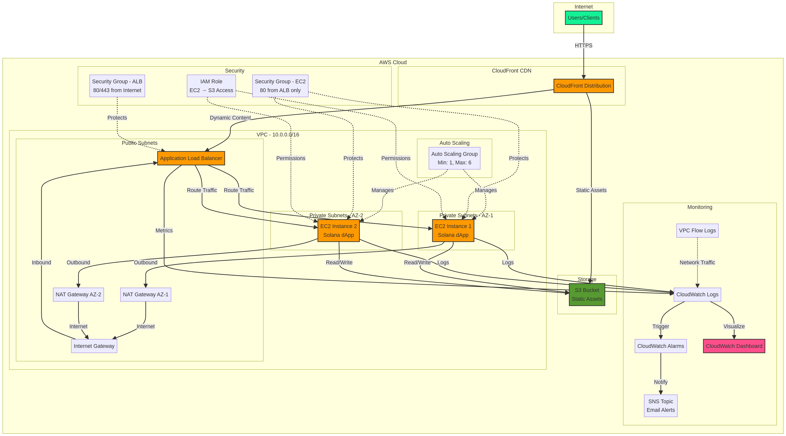

# Solana dApp AWS Infrastructure as Code

[](https://www.terraform.io/)
[](https://aws.amazon.com/)
[](LICENSE)
[](https://github.com/mlakhoua-rgb/solana-dapp-terraform/actions)
[](https://www.checkov.io/)

**AI-Augmented Infrastructure as Code: Demonstrating Strategic Leadership in DevOps**

This repository showcases how experienced infrastructure leaders can orchestrate AI agents as collaborators for hands-on Terraform development while maintaining human ownership of production environments. The project demonstrates production-ready IaC practices developed with AI assistance (Manus AI, Claude, Gemini) for accelerated development, comprehensive testing, and automated security validation—all under strategic human oversight.

**Purpose:** Demonstrate controlled integration of AI agents into Infrastructure and DevOps workflows, where technical leaders guide AI-assisted code development, reviews, and documentation while retaining accountability for production deployments and governance.

**Repository**: [https://github.com/mlakhoua-rgb/solana-dapp-terraform](https://github.com/mlakhoua-rgb/solana-dapp-terraform)

---

## 🤖 AI-Augmented Development Approach

### Human-AI Collaboration Model

This infrastructure was developed using an **orchestrated AI collaboration model** where experienced infrastructure leaders leverage AI agents for specific technical tasks while maintaining strategic oversight and production governance.

**AI Agents Used:**
- **Manus AI**: Primary agent for hands-on Terraform development, module creation, and infrastructure design
- **Claude**: Code review, architecture validation, security best practices, and technical documentation
- **Gemini**: Data analysis, cost optimization insights, and monitoring strategy
- **Perplexity**: Research on AWS best practices, Terraform patterns, and industry standards
- **ChatGPT**: Rapid prototyping, troubleshooting, and problem-solving

**Human Oversight:**
- Strategic architecture decisions and trade-off analysis
- Production deployment approval and governance
- Security policy definition and compliance validation
- Cost management and budget accountability
- Team coordination and stakeholder communication

### DevOps Best Practices with AI Integration

As DevOps and SRE professionals are **production environment owners, not developers**, this repository demonstrates how AI agents can be integrated into workflows for:

- **Automated Code Reviews**: AI-assisted validation of Terraform syntax, security, and best practices
- **Documentation Generation**: AI-augmented creation of architecture diagrams and technical documentation
- **Security Scanning**: Automated security analysis with Checkov and tfsec, human-reviewed exceptions
- **Testing Automation**: AI-assisted test case generation with human validation
- **Continuous Improvement**: AI-powered analysis of infrastructure metrics and optimization recommendations

**Key Principle**: Experienced tech leaders orchestrate AI agents and human teams, maintaining accountability for production environments that should never be owned by non-humans.

---

## 🏗️ Architecture Overview

The Terraform configuration deploys a complete AWS infrastructure with the following components:



### Network Layer
- **VPC** with configurable CIDR blocks
- **Public Subnets** across multiple availability zones for ALB
- **Private Subnets** for EC2 instances with NAT Gateway outbound access
- **Internet Gateway** for public subnet routing
- **NAT Gateways** for secure outbound traffic from private subnets
- **VPC Flow Logs** for network monitoring and security analysis

### Compute Layer
- **Application Load Balancer (ALB)** for distributing traffic
- **Auto Scaling Group** for dynamic instance management
- **EC2 Instances** running the Solana dApp application
- **Launch Template** for consistent instance configuration
- **CloudWatch Logs** for application and system logging

### Storage & CDN Layer
- **S3 Bucket** for static assets and application files
- **CloudFront Distribution** for global content delivery
- **S3 Lifecycle Policies** for automatic cleanup and cost optimization
- **S3 Versioning** for asset management and rollback capability

### Security Layer
- **Security Groups** with least-privilege access rules
- **IAM Roles and Policies** for EC2 instance permissions
- **VPC Flow Logs** for network traffic analysis
- **Public Access Blocks** on S3 buckets
- **Encryption** for S3 and EBS volumes

### Monitoring & Alerting
- **CloudWatch Dashboards** for infrastructure metrics
- **CloudWatch Alarms** for proactive monitoring
- **SNS Topics** for alert notifications
- **CloudWatch Log Groups** for centralized logging

---

## 📋 Prerequisites

### Required Tools
- **Terraform**: Version 1.6 or higher
- **AWS CLI**: Version 2.x
- **Git**: For version control
- **Pre-commit** (optional): For automated code quality checks

### AWS Account Requirements
- AWS account with appropriate permissions
- IAM user with programmatic access (Access Key ID and Secret Access Key)
- Sufficient service quotas for EC2, ALB, and S3

### Permissions Required
The IAM user needs permissions for:
- EC2 (instances, security groups, AMI, launch templates)
- VPC (VPC, subnets, route tables, internet gateways, NAT gateways)
- ELB (application load balancers, target groups)
- S3 (bucket creation, versioning, lifecycle policies)
- CloudFront (distributions, origin access identities)
- IAM (roles, policies, instance profiles)
- CloudWatch (log groups, dashboards, alarms)
- SNS (topics, subscriptions)

---

## 🚀 Quick Start

### 1. Clone the Repository

```bash
git clone https://github.com/mlakhoua-rgb/solana-dapp-terraform.git
cd solana-dapp-terraform
```

### 2. Configure AWS Credentials
```bash
# Option 1: Using AWS CLI
aws configure

# Option 2: Using environment variables
export AWS_ACCESS_KEY_ID="your-access-key"
export AWS_SECRET_ACCESS_KEY="your-secret-key"
export AWS_DEFAULT_REGION="us-east-1"
```

### 3. Prepare Environment Configuration

```bash
# Copy the example configuration
cp environments/dev/terraform.tfvars.example environments/dev/terraform.tfvars

# Edit with your values
nano environments/dev/terraform.tfvars
```

**Important variables to update**:
- `ssh_cidr_blocks`: Replace with your IP address (e.g., "203.0.113.0/32")
- `s3_bucket_name`: Must be globally unique (e.g., "solana-dapp-dev-assets-12345")
- `alert_email`: Your email for CloudWatch alerts

### 4. Initialize Terraform

```bash
cd environments/dev
terraform init
```

### 5. Plan the Deployment

```bash
terraform plan -var-file=terraform.tfvars
```

Review the output to ensure all resources are as expected.

### 6. Apply the Configuration

```bash
terraform apply -var-file=terraform.tfvars
```

Type `yes` when prompted to confirm the deployment.

### 7. Retrieve Outputs

```bash
terraform output
```

This will display:
- ALB DNS name for accessing the application
- CloudFront domain for static assets
- S3 bucket name
- CloudWatch log group
- SNS topic for alerts

---

## 📁 Project Structure

```
solana-dapp-terraform/
├── modules/                          # Reusable Terraform modules
│   ├── vpc/                          # VPC and networking
│   │   ├── main.tf
│   │   ├── variables.tf
│   │   └── outputs.tf
│   ├── security/                     # Security groups and IAM
│   │   ├── main.tf
│   │   ├── variables.tf
│   │   └── outputs.tf
│   ├── compute/                      # ALB, EC2, and ASG
│   │   ├── main.tf
│   │   ├── user_data.sh
│   │   ├── variables.tf
│   │   └── outputs.tf
│   └── storage/                      # S3 and CloudFront
│       ├── main.tf
│       ├── variables.tf
│       └── outputs.tf
├── environments/                     # Environment-specific configurations
│   ├── dev/                          # Development environment
│   │   ├── main.tf
│   │   ├── variables.tf
│   │   ├── outputs.tf
│   │   └── terraform.tfvars.example
│   └── prod/                         # Production environment
│       ├── main.tf
│       ├── variables.tf
│       ├── outputs.tf
│       └── terraform.tfvars.example
├── .github/workflows/                # GitHub Actions workflows
│   └── terraform-ci.yml              # CI/CD pipeline
├── .pre-commit-config.yaml           # Pre-commit hooks
├── .tflint.hcl                       # TFLint configuration
├── ARCHITECTURE.mmd                  # Architecture diagram (Mermaid)
├── ARCHITECTURE.png                  # Architecture diagram (PNG)
├── CHANGELOG.md                      # Version history
├── README.md                         # This file
├── DEPLOYMENT.md                     # Deployment guide
├── MODULES.md                        # Module documentation
└── TROUBLESHOOTING.md                # Troubleshooting guide
```

---

## 🔧 Configuration
### Environment Variables

Create a `terraform.tfvars` file in each environment directory:

```hcl
# AWS Configuration
aws_region = "us-east-1"

# Environment
environment  = "dev"
project_name = "solana-dapp"

# Networking
vpc_cidr              = "10.0.0.0/16"
availability_zones    = ["us-east-1a", "us-east-1b"]
public_subnet_cidrs   = ["10.0.1.0/24", "10.0.2.0/24"]
private_subnet_cidrs  = ["10.0.11.0/24", "10.0.12.0/24"]

# Security
ssh_cidr_blocks = ["YOUR_IP/32"]

# Storage
s3_bucket_name = "solana-dapp-dev-assets-12345"

# Compute
instance_type    = "t3.medium"
min_instances    = 1
max_instances    = 2
desired_instances = 1

# Logging
log_retention_days = 7

# Alerts
alert_email = "your-email@example.com"
```

### Remote State Management

For production deployments, configure remote state storage:

```hcl
# In environments/prod/main.tf, uncomment and configure:
terraform {
  backend "s3" {
    bucket         = "your-terraform-state-bucket"
    key            = "solana-dapp/prod/terraform.tfstate"
    region         = "us-east-1"
    encrypt        = true
    dynamodb_table = "terraform-locks"
  }
}
```

---

## 📊 Deployment Scenarios

### Development Environment

**Purpose**: Testing and development

**Configuration**:
- Single EC2 instance (t3.medium)
- Basic monitoring
- 7-day log retention
- No HTTPS requirement

**Cost**: ~$50-80/month

### Production Environment

**Purpose**: Live application serving users

**Configuration**:
- 3 EC2 instances (t3.large) with auto-scaling up to 6
- Enhanced monitoring and alerting
- 30-day log retention
- HTTPS with ACM certificate
- Multi-AZ deployment

**Cost**: ~$300-500/month (varies with traffic)

---

## 🔐 Security Best Practices
### Network Security
- Private subnets for EC2 instances
- NAT Gateway for secure outbound access
- Security groups with least-privilege rules
- VPC Flow Logs for monitoring

### Data Security
- S3 encryption at rest (AES-256)
- S3 public access blocks
- Versioning enabled for asset recovery
- Lifecycle policies for automatic cleanup

### Access Control
- IAM roles instead of long-term credentials
- Instance profiles for EC2 access to S3
- Restricted SSH access via security groups
- Systems Manager Session Manager for secure access

### Monitoring
- CloudWatch Logs for audit trails
- CloudWatch Alarms for anomalies
- SNS notifications for critical events
- VPC Flow Logs for network analysis

---

## 📈 Scaling Considerations

### Horizontal Scaling
The Auto Scaling Group automatically adjusts instance count based on CPU utilization:
- **Scale Up**: When CPU > 70% for 2 consecutive 5-minute periods
- **Scale Down**: When CPU < 30% for 2 consecutive 5-minute periods

### Vertical Scaling
Modify `instance_type` variable to use larger instances:
- Development: `t3.medium` (2 vCPU, 4 GB RAM)
- Production: `t3.large` (2 vCPU, 8 GB RAM) or `t3.xlarge` (4 vCPU, 16 GB RAM)

### Database Considerations
For future database integration, consider:
- **RDS for MySQL/PostgreSQL**: Managed relational database
- **DynamoDB**: Serverless NoSQL for high-scale applications
- **ElastiCache**: In-memory caching for performance

---

## 🔄 Updating Infrastructure

### Making Changes

1. **Update Terraform code** in the appropriate module or environment
2. **Run terraform plan** to preview changes
3. **Review the plan** carefully
4. **Run terraform apply** to apply changes
5. **Verify** the changes in AWS Console

### Example: Scaling Up

```bash
# Update environments/prod/terraform.tfvars
desired_instances = 5  # Increase from 3 to 5

# Plan and apply
cd environments/prod
terraform plan -var-file=terraform.tfvars
terraform apply -var-file=terraform.tfvars
```

---

## 🚨 Monitoring & Alerts

### CloudWatch Dashboards

Access dashboards in AWS Console:
- Navigate to CloudWatch → Dashboards
- View metrics for ALB, EC2, CloudFront, and S3

### CloudWatch Alarms
Configured alarms:
- **ALB CPU Utilization**: Alert when > 70%
- **ALB Unhealthy Hosts**: Alert when > 0
- **ALB Response Time**: Alert when > 1 second (prod only)
- **CloudFront 5xx Error Rate**: Alert when > 1% (prod only)

### Email Alerts

Subscribe to SNS topic notifications:
1. Check your email for SNS subscription confirmation
2. Click the confirmation link
3. Receive alerts for configured alarms

---

## 💰 Cost Optimization

### Cost Reduction Strategies

1. **Use Reserved Instances**: 30-40% savings for 1-year commitment
2. **Spot Instances**: 70% savings for non-critical workloads
3. **S3 Lifecycle Policies**: Automatic transition to cheaper storage classes
4. **CloudFront Caching**: Reduce origin requests and bandwidth costs
5. **Right-sizing**: Use appropriate instance types for your workload

### Estimated Monthly Costs

| Component | Dev | Prod |
|-----------|-----|------|
| EC2 Instances | $30 | $150 |
| ALB | $16 | $16 |
| NAT Gateway | $0 | $32 |
| S3 | $5 | $20 |
| CloudFront | $5 | $50 |
| CloudWatch | $5 | $15 |
| **Total** | **~$61** | **~$283** |

---

## 🔗 Integration with CI/CD

### GitHub Actions Workflow

The `.github/workflows/terraform-ci.yml` workflow:
1. Validates Terraform syntax on every push
2. Plans changes on pull requests
3. Applies changes to dev on merge to develop branch
4. Applies changes to prod on merge to main branch
5. Runs security scans with Checkov and tfsec
6. Estimates infrastructure costs with Infracost

### Setting Up CI/CD

1. Add AWS credentials to GitHub Secrets:
   - `AWS_ACCESS_KEY_ID`
   - `AWS_SECRET_ACCESS_KEY`
   - `AWS_ACCESS_KEY_ID_PROD` (for production)
   - `AWS_SECRET_ACCESS_KEY_PROD` (for production)
   - `INFRACOST_API_KEY` (optional, for cost estimation)

2. Workflow automatically triggers on:
   - Push to main or develop branch
   - Pull requests to main or develop branch

### Pre-commit Hooks

Install pre-commit hooks for local validation:

```bash
# Install pre-commit
pip install pre-commit

# Install hooks
pre-commit install

# Run manually
pre-commit run --all-files
```

---

## 📚 Additional Documentation

- **[ARCHITECTURE.md](ARCHITECTURE.md)**: Detailed architecture documentation with diagrams
- **[DEPLOYMENT.md](DEPLOYMENT.md)**: Detailed deployment guide
- **[MODULES.md](MODULES.md)**: Module-by-module documentation
- **[TROUBLESHOOTING.md](TROUBLESHOOTING.md)**: Common issues and solutions
- **[CHANGELOG.md](CHANGELOG.md)**: Version history and release notes

---

## 🆘 Troubleshooting

### Common Issues

**Issue**: Terraform init fails with "access denied"
- **Solution**: Verify AWS credentials and IAM permissions

**Issue**: S3 bucket name already exists
- **Solution**: S3 bucket names are globally unique; modify `s3_bucket_name` variable

**Issue**: EC2 instances fail to start
- **Solution**: Check CloudWatch logs in `/aws/ec2/{environment}/app`

For more troubleshooting, see [TROUBLESHOOTING.md](TROUBLESHOOTING.md).

---

## 🤝 Contributing


Contributions are welcome! Please:
1. Fork the repository
2. Create a feature branch
3. Test changes thoroughly
4. Submit a pull request

---

## 📄 License

This project is licensed under the MIT License.

---

## 📞 Support

For issues, questions, or suggestions:
1. Check [TROUBLESHOOTING.md](TROUBLESHOOTING.md)
2. Open an issue on GitHub
3. Contact the development team

---

**Developed with AI-Augmented Leadership**

This repository demonstrates how experienced infrastructure leaders can orchestrate AI agents (Manus AI, Claude, Gemini, Perplexity, ChatGPT) as collaborators for hands-on IaC development while maintaining human ownership of production environments and strategic decision-making.

**Created by:** Mohamed Ben Lakhoua | [LinkedIn](https://www.linkedin.com/in/benlakhoua/) | [GitHub](https://github.com/mlakhoua-rgb)

*Last Updated: January 2026*
